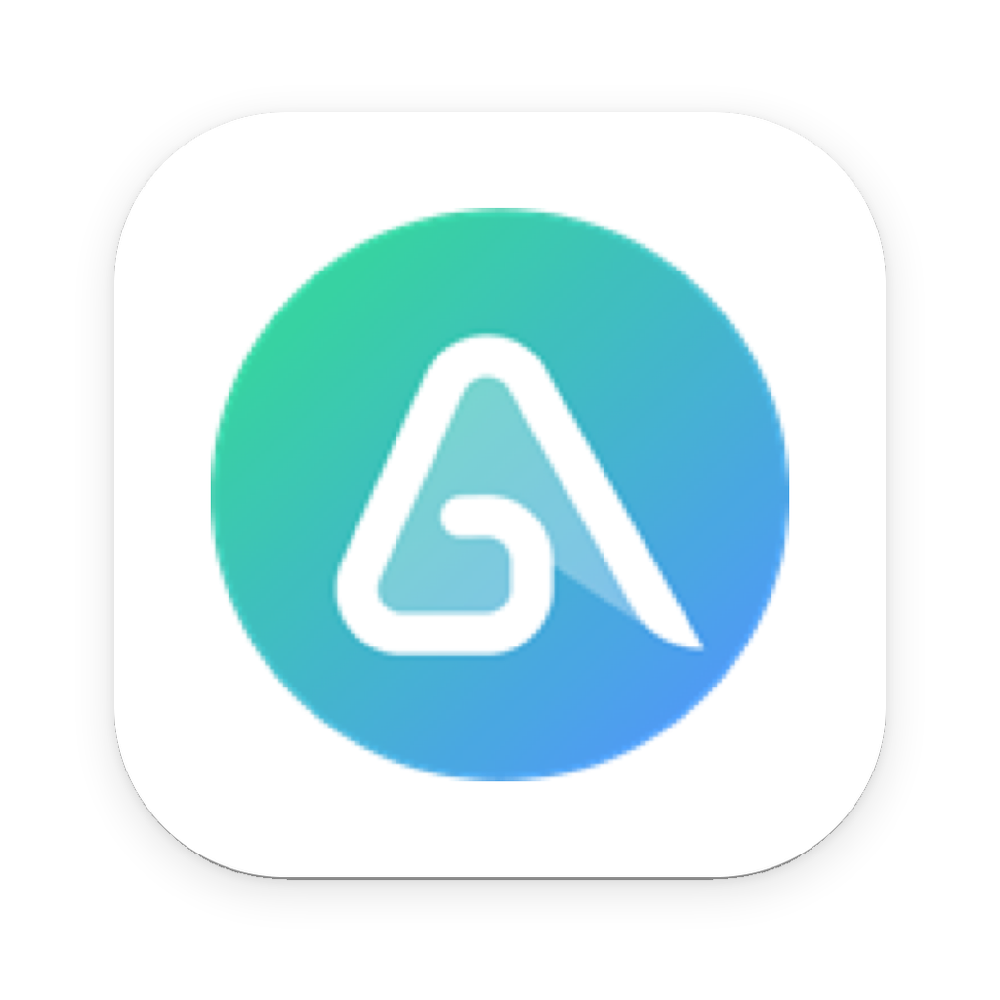
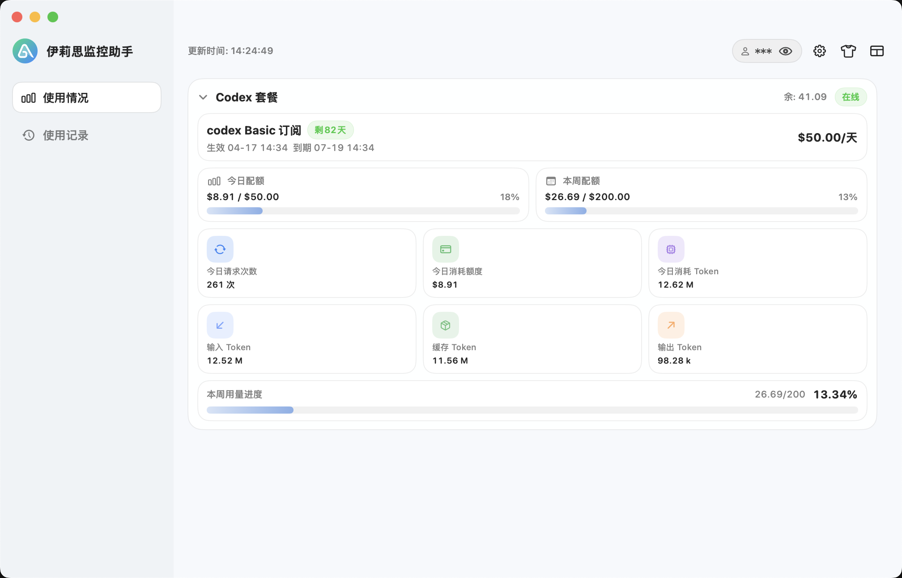
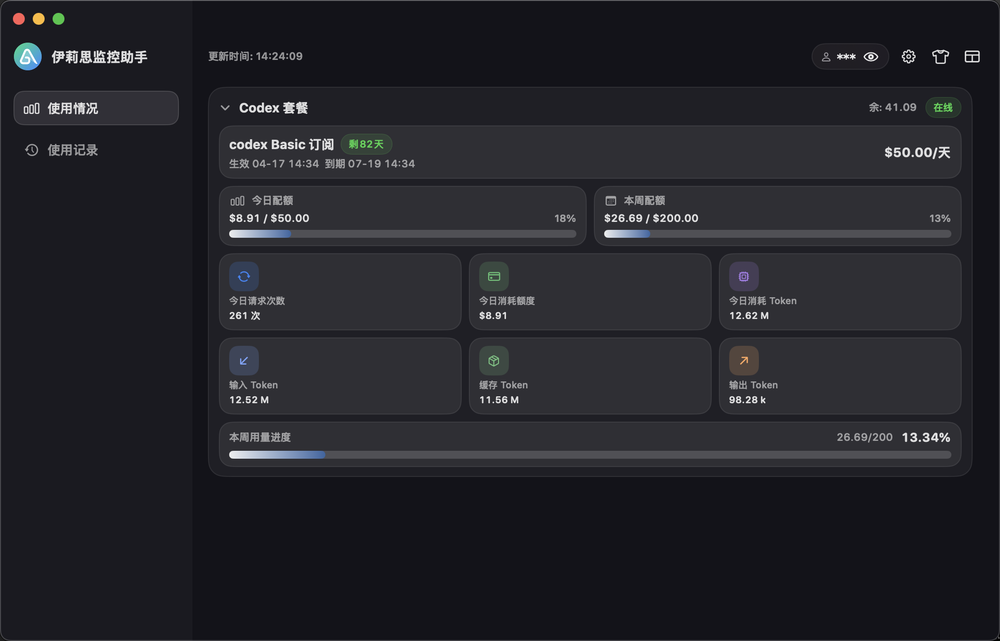

# (伊莉思)[https://ylscode.com]监控助手

原生 macOS 桌面应用，用于监控伊莉思 Codex / AGI 套餐额度、使用情况、使用记录和本地 MCP 快照数据。应用提供状态栏入口、桌面仪表盘、套餐源切换、主题换肤、状态栏样式配置和本地 HTTP MCP 服务，方便用户和 AI Agent 获取当前账户状态。


## 应用展示

<p align="center">
  
</p>

<p align="center">
  
  
</p>

## 功能概览

- Codex 套餐监控：余额、每日配额、本周配额、请求次数、Token 消耗、费用统计、套餐到期信息。
- AGI 套餐监控：套餐字节总量、剩余字节、已用字节、用量进度、最近到期套餐。
- 使用记录：分页展示 Codex 使用日志，包含时间、模型、Token、费用和明细入口。
- 状态栏展示：支持多种菜单栏显示样式，包括余额、已用百分比、剩余百分比、上下双行和圆环样式。
- 多数据源：支持 Codex 套餐与 AGI 套餐，支持单显 / 双显统计模式。
- 设置能力：API Key、轮询间隔、开机自启、状态栏文字颜色、MCP 服务端口。
- 个性皮肤：官方主题、跟随系统、亮色 / 暗色主题、自定义颜色换肤。
- 本地 MCP 服务：向本机 AI Agent 暴露账户快照，支持 HTTP 快照接口和 MCP JSON-RPC 风格接口。
- 自动刷新：按配置周期轮询接口，也支持手动立即刷新。

## 系统要求

- macOS 13.0 或更高版本
- Xcode / Command Line Tools
- Swift 6.1 或更高版本

检查环境：

```bash
swift --version
xcode-select -p
```

## 项目结构

```text
.
├── Package.swift
├── README.md
├── Sources/yls-app
│   ├── App/                  # AppDelegate、窗口、状态栏入口
│   ├── Core/                 # 模型、状态管理、UserDefaults 配置
│   ├── MCP/                  # 本地 MCP / HTTP 快照服务
│   ├── Networking/           # Codex / AGI 网络请求
│   ├── Resources/            # 应用资源
│   └── UI/                   # SwiftUI 仪表盘和设置界面
├── images/                   # README 截图、Logo、DMG 背景
└── scripts/
    └── build_macos_app.sh    # 本地 .app / .dmg 打包脚本
```

## 运行

### 命令行运行

```bash
swift run yls-app
```

运行后会打开应用窗口，并在 macOS 状态栏显示入口。首次使用需要在设置中填入 API Key。

### Xcode 运行

1. 打开 Xcode。
2. 选择 `File -> Open...`，打开项目根目录。
3. 选择 `yls-app` 可执行目标。
4. 点击 `Run`。

### 常用开发命令

```bash
# Debug 构建
swift build

# Release 构建
swift build -c release

# 清理构建缓存
swift package clean
```

## 配置说明

应用配置保存在当前 macOS 用户的 `UserDefaults` 中，主要配置包括：

- Codex API Key
- AGI API Key
- 当前套餐源
- 统计显示模式
- 轮询间隔
- 状态栏显示样式
- 状态栏文字颜色
- MCP 是否启用
- MCP 端口
- 开机自启
- 皮肤主题与自定义颜色

AGI Key 也支持通过环境变量初始化：

```bash
export YLS_AGI_KEY="你的 AGI Token"
swift run yls-app
```

API Key 输入时只需要填写 token 本体，应用会自动以 `Authorization: Bearer <token>` 形式请求接口。

## 远程接口

### Codex 套餐信息

```http
GET https://code.ylsagi.com/codex/info
Authorization: Bearer <codex_api_key>
```

用途：

- 获取 Codex 余额
- 获取套餐用量
- 获取每日 / 每周配额
- 获取套餐到期信息

### Codex 使用日志

```http
GET https://code.ylsagi.com/codex/logs
Authorization: Bearer <codex_api_key>
```

用途：

- 获取 Codex 使用记录
- 展示模型、Token、费用、明细链接等数据
- 支持应用内分页展示

### AGI 套餐信息

```http
GET https://api.ylsagi.com/user/package
Authorization: Bearer <agi_api_key>
```

用途：

- 获取 AGI 套餐列表
- 汇总总字节、剩余字节、已用字节
- 计算 AGI 用量进度和最近到期时间

## 本地 MCP 服务

应用可在本机启动 HTTP 服务，默认地址：

```text
http://127.0.0.1:8765
```

可在应用设置中启用 / 关闭 MCP 服务，并修改端口。

### HTTP 端点

- `GET /health`
- `GET /snapshot`
- `GET /mcp/snapshot`
- `POST /mcp`

示例：

```bash
curl http://127.0.0.1:8765/mcp/snapshot
```

快照内容包含：

- 当前状态
- 最后更新时间
- 当前套餐源
- Codex / AGI Key 是否已配置
- 余额、用量、进度、续费 / 到期时间
- Codex 使用统计与日志摘要
- MCP 服务状态
- 当前轮询间隔
- 状态栏显示样式

### MCP JSON-RPC 能力

支持的方法：

- `initialize`
- `notifications/initialized`
- `tools/list`
- `tools/call`
- `resources/list`
- `resources/read`

内置对象：

- Tool: `get_codex_monitor_snapshot`
- Resource: `yls://codex-monitor/snapshot`

调用 Tool 示例：

```bash
curl -X POST http://127.0.0.1:8765/mcp \
  -H 'Content-Type: application/json' \
  -d '{
    "jsonrpc": "2.0",
    "id": 1,
    "method": "tools/call",
    "params": {
      "name": "get_codex_monitor_snapshot"
    }
  }'
```

读取 Resource 示例：

```bash
curl -X POST http://127.0.0.1:8765/mcp \
  -H 'Content-Type: application/json' \
  -d '{
    "jsonrpc": "2.0",
    "id": 2,
    "method": "resources/read",
    "params": {
      "uri": "yls://codex-monitor/snapshot"
    }
  }'
```

## 本地打包

项目提供 macOS `.app` 和 `.dmg` 打包脚本：

```bash
scripts/build_macos_app.sh
```

默认输出：

```text
dist/伊莉思监控助手.dmg
```

脚本会执行：

1. `swift build -c release`
2. 生成 `.app` 目录结构
3. 生成 `Info.plist`
4. 从 `images/yls_logo_1024.png` 生成应用 `.icns`，并用 `images/yls_logo.png` 作为 DMG 安装界面展示图标的小尺寸档
5. 执行 ad-hoc codesign
6. 生成带背景图的 DMG

默认构建通用二进制：

```bash
BUILD_ARCHS="arm64 x86_64" scripts/build_macos_app.sh
```

只构建单架构：

```bash
BUILD_ARCHS="arm64" scripts/build_macos_app.sh
BUILD_ARCHS="x86_64" scripts/build_macos_app.sh
```

常用可配置环境变量：

```bash
APP_VERSION="0.2.0" \
APP_BUILD="12" \
BUNDLE_ID="com.yls.codex-monitor" \
APP_DISPLAY_NAME="伊莉思监控助手" \
scripts/build_macos_app.sh
```

## 发布流程

如果仓库启用了 GitHub Actions 工作流，可通过版本 tag 触发自动构建和发布：

```bash
git tag v0.1.0
git push origin v0.1.0
```

预期产物：

- `伊莉思监控助手.dmg`
- `.app` 应用包
- `arm64 + x86_64` 通用二进制

## 常见问题

### 运行后提示未配置 Key

在应用设置中分别配置 Codex API Key 和 AGI API Key。只填写 token 本体，不需要填写 `Bearer` 前缀。

### MCP 端口启动失败

检查端口是否被占用：

```bash
lsof -i :8765
```

如被占用，可在应用设置中修改 MCP 端口。

### 命令行构建遇到 SwiftPM 缓存权限问题

如果沙箱或权限限制导致 SwiftPM 无法写入缓存，可清理后重新构建，或指定可写缓存目录：

```bash
swift package clean
CLANG_MODULE_CACHE_PATH=/tmp/yls-clang-cache swift build
```

### 打包后应用无法打开

当前脚本使用 ad-hoc 签名，适合本地测试。正式分发需要使用 Apple Developer 证书签名并完成 notarization。

## 开发说明

- UI 使用 SwiftUI 实现。
- 状态栏、窗口和系统能力由 AppKit 管理。
- 网络层集中在 `Sources/yls-app/Networking`。
- 状态管理和数据转换集中在 `Sources/yls-app/Core`。
- MCP 服务是本机 HTTP 服务，仅监听 `127.0.0.1`。
- 不要将真实 API Key 提交到仓库。
